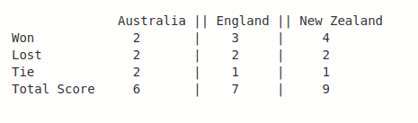

## Practice Statement: Winner of the Tri-Series Cricket Tournament

**In Australia, a tri-series, one-day international (ODI)  cricket tournament is being contested by 
Australia, England and New Zealand. All three teams have played six round-robin matches. 
Now, the organisers have to determine the winner of the series.
Each team is awarded 2 points for a match won, 1 point for a match that runs into a tie 
and no points for a lost match. The following table represents the scores obtained by each team.**

**Write a program that accepts the total score of each team and displays the name of the winner 
team of the series.**

Hint: Use Ternary Operator
